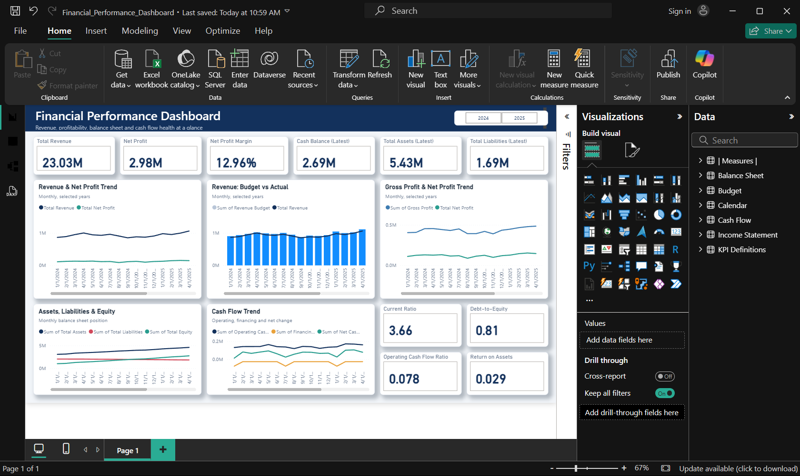

# Task 1 – Financial Performance Dashboard

## 📊 Project Overview

The **Financial Performance Dashboard** is an interactive Power BI dashboard designed to provide a clear overview of financial performance through key financial metrics, trends, and visual analysis.

The dashboard helps users understand financial performance and identify important patterns using interactive Power BI visualizations.

## 🎯 Objective

The main objective of this project is to transform financial data into an interactive and easy-to-understand dashboard that supports financial analysis and decision-making.

## 📌 Key Features

- Interactive financial KPI cards
- Financial performance trend analysis
- Profitability analysis
- Budget vs Actual analysis
- Balance Sheet analysis
- Cash Flow analysis
- Financial ratio analysis
- Interactive Power BI visualizations
- User-friendly dashboard layout

## 📈 Dashboard Analysis

The dashboard provides insights into:

- Revenue and financial performance
- Profitability trends
- Budget vs Actual performance
- Balance Sheet position
- Cash Flow performance
- Key financial ratios
- Overall financial health

## 🛠️ Tools & Technologies

- **Power BI Desktop**
- **DAX**
- **Power Query**
- **Data Modeling**
- **Data Visualization**

## 📷 Dashboard Preview

## 📁 Project Files

| File | Description |
|---|---|
| `Financial_Performance_Dashboard.pbix` | Power BI dashboard project file |
| `Financial_Performance_Dashboard.png` | Dashboard preview screenshot |

## 💡 Key Outcome

This project demonstrates the ability to transform financial data into an interactive Power BI dashboard and present financial information through meaningful KPIs and visualizations.

## 👨‍💻 Internship Task

**CodeAlpha Power BI Internship – Task 1**

---

### Author

**Atharva Kulkarni**
