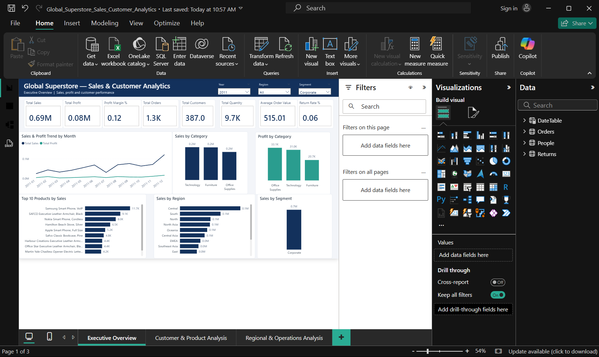
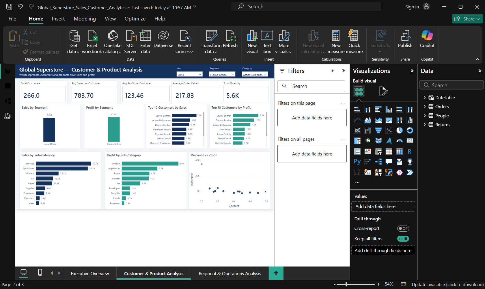
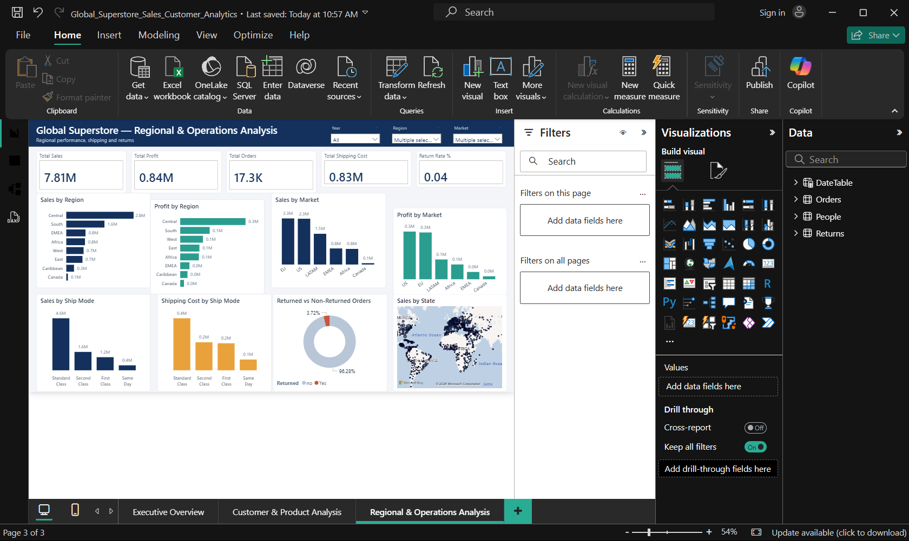

# Task 2 – Global Superstore Sales & Customer Analytics

## 📊 Project Overview

The **Global Superstore Sales & Customer Analytics Dashboard** is an interactive Power BI report designed to analyze sales, profitability, customers, products, regional performance, and operational metrics.

The dashboard transforms the Global Superstore dataset into an interactive analytical report using Power Query, data modeling, DAX measures, and Power BI visualizations.

## 🎯 Objective

The objective of this project is to analyze business performance and provide meaningful insights into:

- Sales and profitability
- Customer performance
- Product and category performance
- Regional and market performance
- Shipping and operational performance
- Returned orders
- Sales and profit trends

## 📑 Dashboard Pages

### 1. Executive Overview

The Executive Overview provides a high-level summary of business performance.

**Key KPIs:**
- Total Sales
- Total Profit
- Profit Margin %
- Total Orders
- Total Customers
- Total Quantity
- Average Order Value
- Return Rate %

**Visual Analysis:**
- Sales by Category
- Profit by Category
- Sales by Region
- Sales & Profit Trend by Year Month
- Top 10 Products by Sales
- Sales by Segment

**Filters:**
- Year
- Region
- Segment

---

### 2. Customer & Product Analysis

This page focuses on customer behavior and product/category performance.

**Key KPIs:**
- Total Customers
- Average Sales per Customer
- Average Profit per Customer
- Average Order Value
- Total Quantity

**Visual Analysis:**
- Sales by Segment
- Profit by Segment
- Top 10 Customers by Sales
- Top 10 Customers by Profit
- Sales by Sub-Category
- Profit by Sub-Category
- Discount vs Profit Analysis

**Filters:**
- Year
- Segment
- Category

---

### 3. Regional & Operations Analysis

This page provides regional and operational performance analysis.

**Key KPIs:**
- Total Sales
- Total Profit
- Total Orders
- Total Shipping Cost
- Return Rate %

**Visual Analysis:**
- Sales by Region
- Profit by Region
- Sales by Market
- Profit by Market
- Sales by Ship Mode
- Shipping Cost by Ship Mode
- Returned vs Non-Returned Orders
- Sales by State Map

**Filters:**
- Year
- Region
- Market

## 🛠️ Tools & Technologies

- **Power BI Desktop**
- **Power Query**
- **DAX**
- **Data Modeling**
- **Data Visualization**

## 🔧 Data Preparation & Modeling

The project includes data preparation and transformation using Power Query.

Key steps include:

- Data cleaning and transformation
- Removal of unnecessary columns
- Renaming columns for clarity
- Handling missing values
- Cleaning the Returns data
- Removing duplicate Return Order IDs
- Merging Returns information with Orders
- Creating a dedicated Date table
- Establishing relationships between Date, People, and Orders tables

### Data Model

The main model includes:

- **Orders**
- **People**
- **DateTable**
- **Returns** as the source table used during the Returns data preparation process

The Date table is connected to Orders using the Order Date field, while People is connected to Orders using Region.

## 📐 DAX Measures

The dashboard uses DAX measures for business calculations, including:

- Total Sales
- Total Profit
- Total Orders
- Total Customers
- Total Quantity
- Average Order Value
- Average Profit per Order
- Average Discount
- Total Shipping Cost
- Profit per Unit
- Returned Orders
- Return Rate %
- Average Sales per Customer
- Average Profit per Customer
- Previous Year Sales
- Sales Growth %
- Previous Year Profit
- Profit Growth %
- Sales YTD
- Profit YTD

These measures enable dynamic analysis across different dates, regions, segments, categories, markets, customers, and products.

## 📷 Dashboard Preview

### Executive Overview

### Customer & Product Analysis

### Regional & Operations Analysis

## 📁 Project Files

| File | Description |
|---|---|
| `Global_Superstore_Sales_Customer_Analytics.pbix` | Complete Power BI report |
| `Global_Superstore_Executive_Overview.png` | Executive Overview screenshot |
| `Global_Superstore_Customer_Product_Analysis.png` | Customer & Product Analysis screenshot |
| `Global_Superstore_Regional_Operations_Analysis.png` | Regional & Operations Analysis screenshot |

## 💡 Key Outcome

This project demonstrates the ability to transform a large business dataset into an interactive Power BI analytical solution using:

- Data cleaning
- Power Query transformations
- Data modeling
- DAX calculations
- KPI development
- Interactive filtering
- Business-focused data visualization

The resulting dashboard provides a consolidated view of sales, profitability, customer, product, regional, and operational performance.

## 👨‍💻 Internship Task

**CodeAlpha Power BI Internship – Task 2**

### Author

**Atharva Kulkarni**
